# 东南大学编译原理课程实验一词法分析器

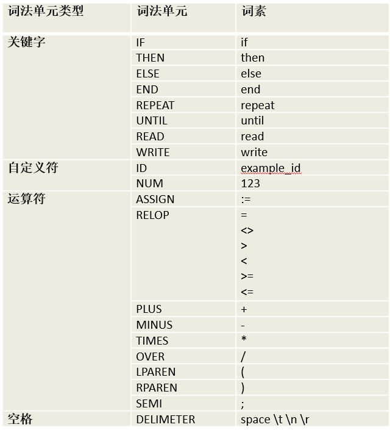
还加入了多行注释和单行注释

## a)定义正则表达式

**1.辅助字符集**
定义一些辅助性基础字符集，方便后续引用

    digit -> [0-9]
    letter -> [a-zA-Z]

**2.关键字**
这些是语言的保留字，直接匹配具体的字符串

    IF -> if
    THEN -> then
    ELSE -> else
    END -> end
    REPEAT -> repeat
    UNTIL -> until
    READ -> read
    WRITE -> write

**3.自定符号**
标识符由字母开头，后面可以跟字母、数字或下划线;这里只实现了定义为无符号整数

    ID -> letter(letter|digit|_)*
    NUM -> digit+

**4.关系运算符**
包含了所有比较大小的符号

    RELOP -> <>|<=|>=|=|<|>

**5.赋值符号**
这里使用`:=`,与关系运算符中的等号做区分

    ASSIGN -> :=

**6.其他运算符**
包括了加减乘除，左右括号，分号

    PLUS -> +
    MINUS -> -
    TIMES -> *
    OVER -> /
    LPAREN -> (
    RPAREN -> )
    SEMI -> ;

**7.空格**
空格，制表符等

    DELIMETER -> SPACE|\t|\n|\r

**8.注释**
包括单行注释`//`和多行注释`/* */`

    COMMENT_SINGLE -> //[^\n]*
    COMMENT_MULTI -> /\*[\s\S]*?\*/

## b)将以上正则表达式转化为NFA

关键字只能是固定字符串。我们以 IF -> if 为例展示如何构造 NFA，其余类似。
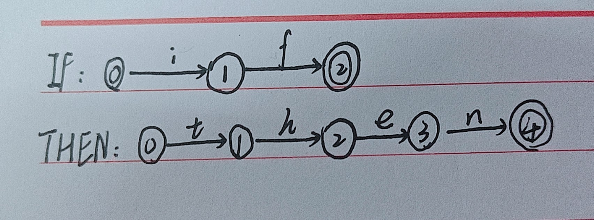

自定义符号
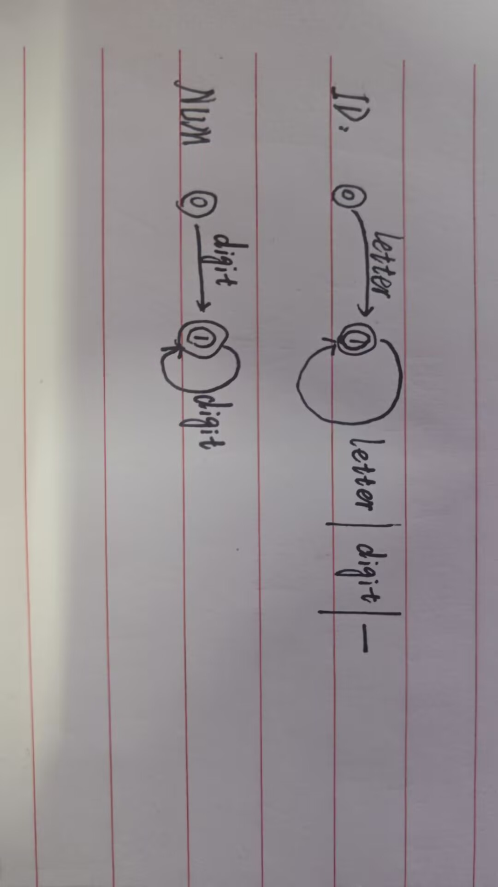

关系运算符
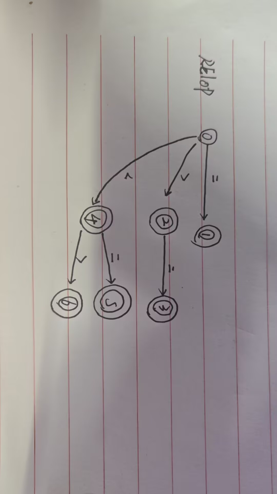

赋值运算符
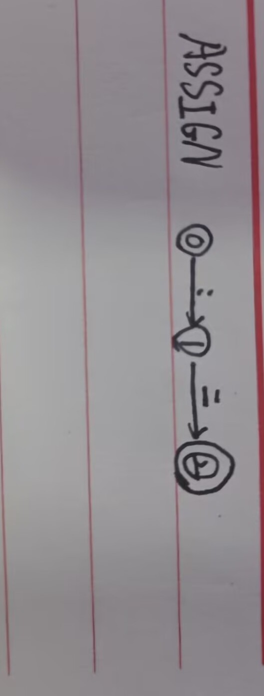
其他运算符，只接受单个符号，与关键字类似，不再演示

空格，同样只接受单个符号，与关键字类似，不再演示

注释
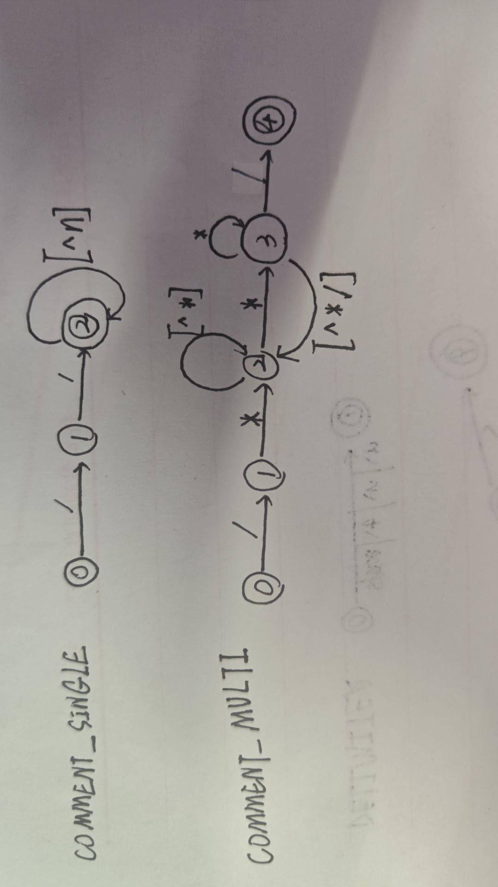

## c)将多个NFA合成一个

可以用一个新的S作为初始状态，用ε边连接前面所有NFA的初始状态
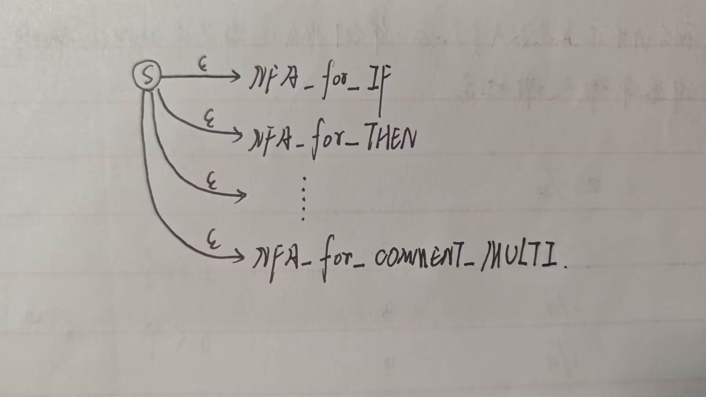

## d)将NFA转化为状态最小化的DFA

首先将NFA转化为DFA
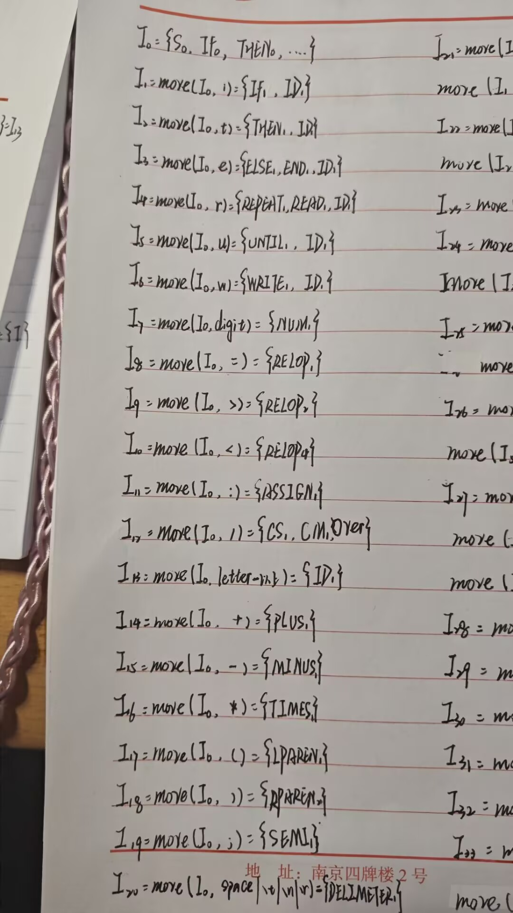
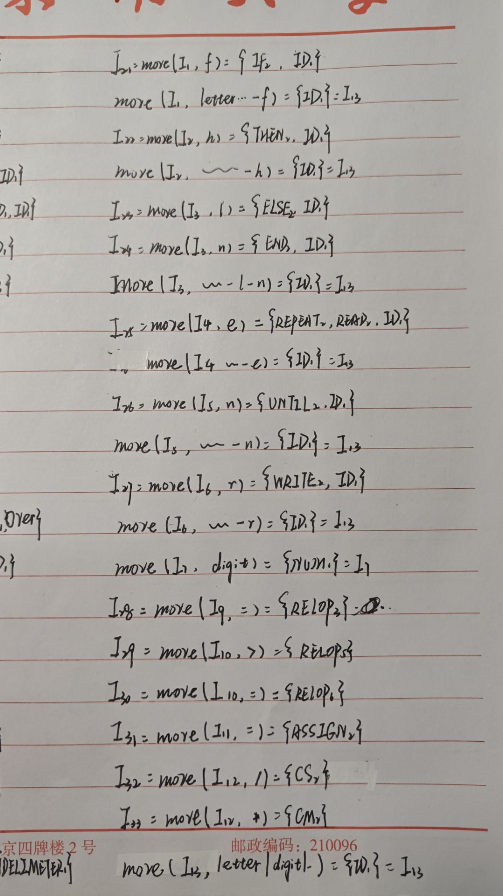
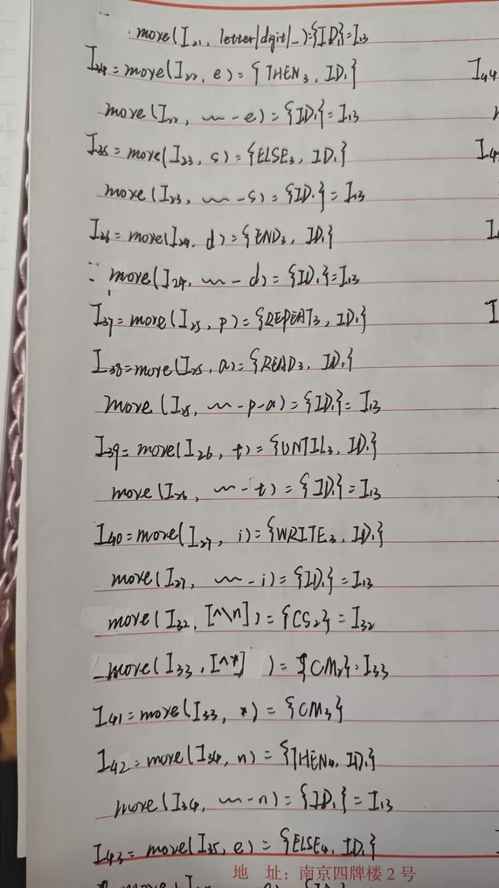
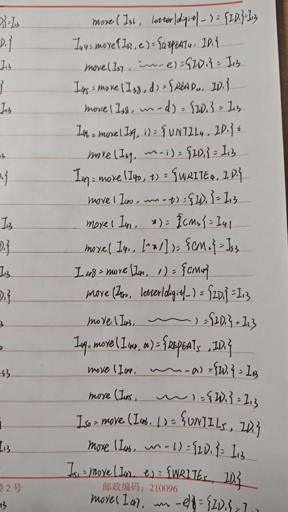
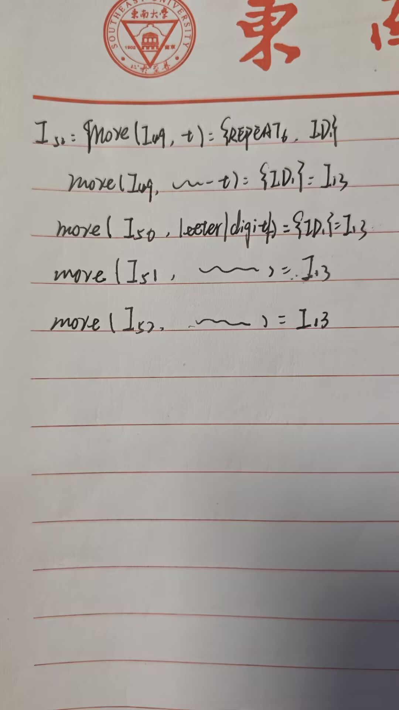

然后进行DFA最小化，经过尝试，仅有RELOP部分可以最小化，这里仅展示该部分
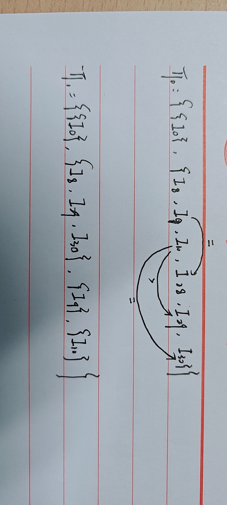

## e)依据DFA编写程序

## 后续改变

1.现在的token太过简单，于是又添加了`[`和`]`这两个符号，方便后续的语法分析器中加入数组，因为这两个符号都是单字符的且之前从未出现过，所以能很轻松的添加到现有DFA中，程序改写也很简单。Token.hpp中添加了LBRACKET和RBRACKET，State.hpp中添加s28和s29两个状态

2.为了消除数组声明带来的二义性，增加了ARRAY关键字，用于数组声明，在Token.hpp中添加了ARRAY，State.hpp中添加s53,s54,s55,s56,s57,五个状态，其中第五个是对应接受状态，前四个接受到对应字母进入下一个状态。
